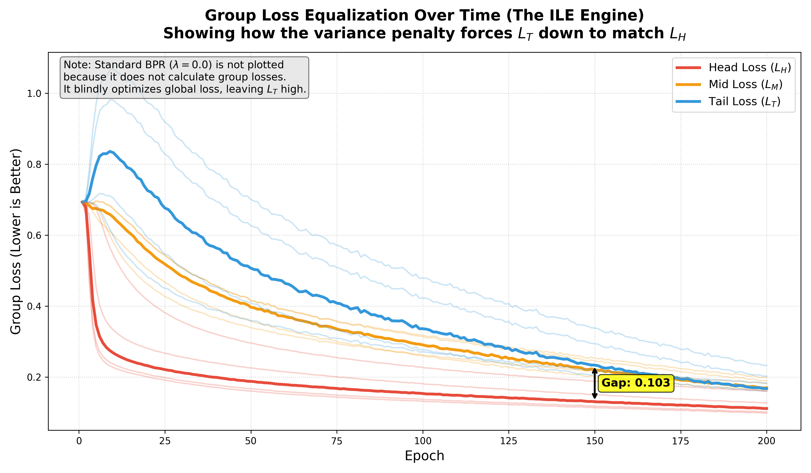
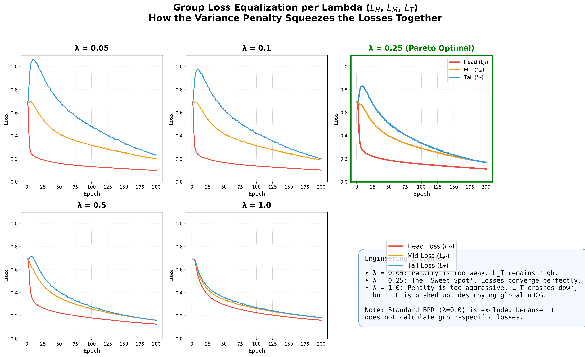
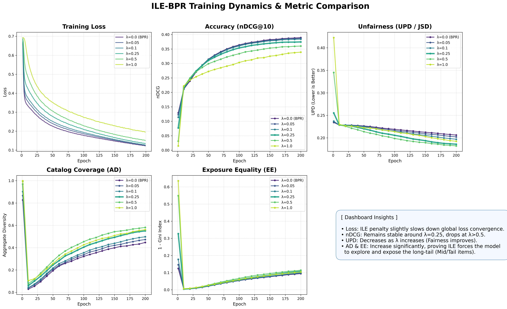
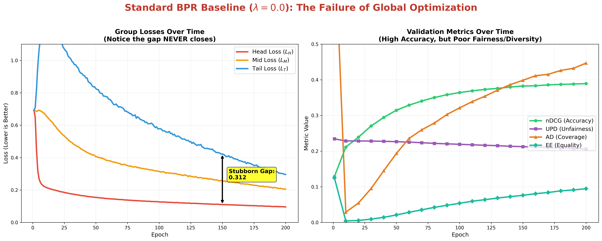
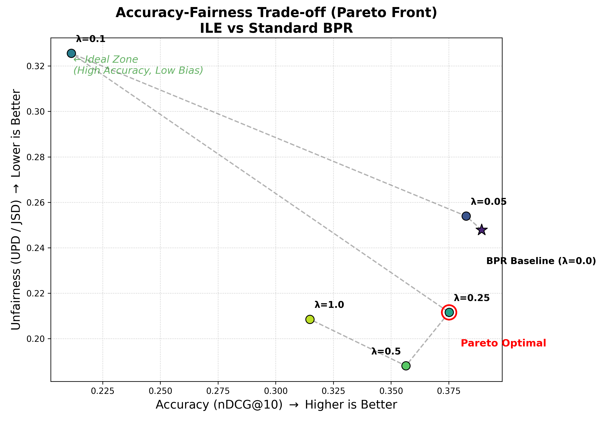
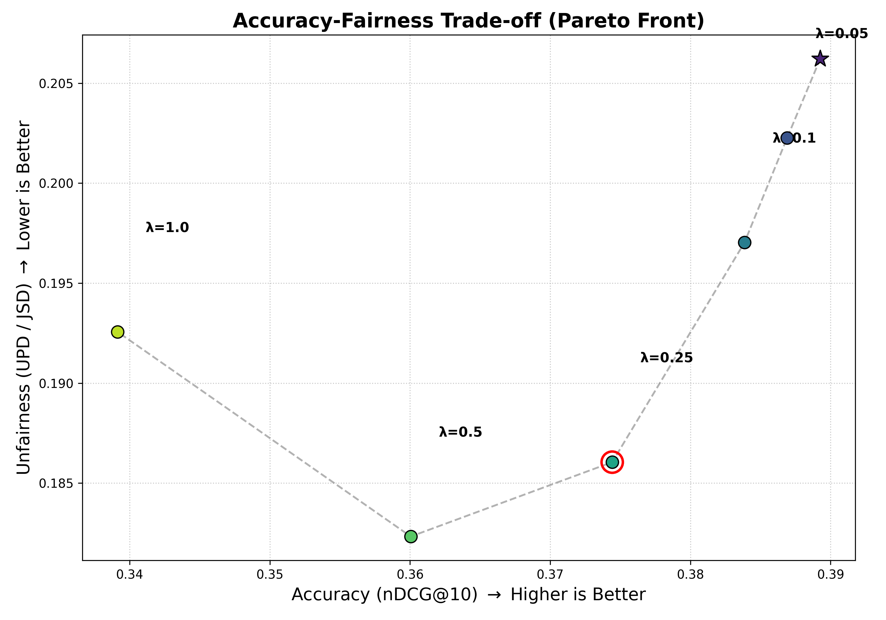

# Group loss equalisation for BPR

Production-quality implementation of **"Correcting Popularity Bias in Recommender Systems group loss equalisation"** by Juno Prent and Masoud Mansoury (ACM RecSys 2024 Workshop).

## Overview

This repository implements Item Loss Equalization (ILE), an in-processing approach that corrects popularity bias in recommender systems by equalizing training loss across item popularity groups (Head, Mid, Tail).

### Key Features
- **BPR Base Model**: Bayesian Personalized Ranking with matrix factorization
- **group equalise Loss**: Three distance functions (STD, ENT, MAD) for loss equalization
- **Fairness Metrics**: UPD, AD, EE commonly used in rescys
- **Datasets**: MovieLens-1M, Goodreads, Google Reviews
- **Reproducibility**: Full seed control, deterministic execution, checkpointing

## Installation

```bash
# Clone repository
git clone https://github.com/Lomesh2000/recsys-popularity-bias
cd recsys

# Create environment
conda env create -f environment.yml
conda activate ile-bpr

# Or use pip
pip install -r requirements.txt
```

## Dataset Preparation

```bash
# Download and preprocess all datasets
python scripts/download_data.py --dataset all
python scripts/preprocess.py --dataset all

# Or individually
python scripts/download_data.py --dataset movielens-1m
python scripts/preprocess.py --dataset movielens-1m
```

## Training

```bash
# Train ILE-BPR with STD distance on MovieLens-1M
python train.py --config configs/default.yaml     --dataset movielens-1m     --distance std     --lambda_ile 0.25

# Train base BPR (no ILE)
python train.py --config configs/default.yaml     --dataset movielens-1m     --distance none     --lambda_ile 0.0

# Train with different distance functions
python train.py --dataset movielens-1m --distance ent --lambda_ile 0.04
python train.py --dataset movielens-1m --distance mad --lambda_ile 0.3
```

## Evaluation

```bash
# Evaluate a trained model
python evaluate.py --checkpoint checkpoints/movielens-1m_std_0.25/best_model.pt

# Run full benchmark across all methods
python scripts/benchmark.py --dataset movielens-1m
```

## Inference

```bash
# Generate recommendations for a user
python inference.py --checkpoint checkpoints/movielens-1m_std_0.25/best_model.pt     --user_id 42     --top_k 10
```

## Expected Results (MovieLens-1M)

| Method | nDCG↑ | UPD↓ | AD↑ | EE↑ |
|--------|-------|------|-----|-----|
| BPR | ~0.269 | ~0.121 | ~0.423 | ~0.096 |
| ILE (STD, λ=0.25) | ~0.226 | ~0.067 | ~0.488 | ~0.130 |
| ILE (ENT, λ=0.04) | ~0.224 | ~0.070 | ~0.525 | ~0.151 |
| ILE (MAD, λ=0.30) | ~0.241 | ~0.093 | ~0.444 | ~0.103 |

## Visual Results

The following plots summarize how ILE changes optimization, group-level loss, and the accuracy-fairness trade-off. Unless stated otherwise, the runs use the MovieLens-1M setup and compare the standard BPR baseline with ILE-BPR configurations.

### 1. Group Loss Equalization Over Time



This plot shows the head, mid, and tail item-group losses during ILE training. The penalty reduces the initially large tail-loss gap and moves the group losses closer together over the 200-epoch run. Standard BPR is omitted because it does not compute group-specific losses.

### 2. Effect of the Equalization Weight



This comparison shows how the ILE weight lambda controls the strength of equalization. Small values leave a wider separation between group losses, while the highlighted lambda=0.25 setting provides the most balanced convergence in this sweep. Larger values can overcorrect the groups and change the optimization dynamics.

### 3. ILE Training Dynamics and Metric Comparison



The six panels track training loss, nDCG@10, UPD, AD, and EE across lambda values. Increasing the equalization weight generally improves fairness-oriented metrics and catalog coverage, while very large weights reduce recommendation accuracy. The plot makes the practical trade-off visible: lambda=0.25 is a strong middle ground before the accuracy degradation becomes more pronounced.

### 4. Standard BPR Baseline Telemetry



This dashboard illustrates the behavior of standard BPR without the group-loss penalty. Overall loss decreases, but the group-loss curves retain a persistent gap, with tail items receiving substantially higher loss. The validation panels show that the baseline maintains strong accuracy while offering weaker fairness and exposure balance.

### 5. Accuracy-Fairness Pareto Front



This Pareto plot places nDCG@10 on the horizontal axis and UPD on the vertical axis, where higher accuracy and lower bias are preferred. The ILE configurations trace the trade-off frontier, and $bb=0.25$ is highlighted as the selected Pareto-optimal operating point relative to the tested runs.

### 6. Pareto Front Across Grouping Choices



This second Pareto view compares the tested lambda settings under the grouping analysis. It emphasizes how stronger equalization can lower popularity bias while changing nDCG, with lambda=0.5 highlighted as the best balance in this particular view. Together with the previous plot, it shows why lambda selection depends on the desired accuracy-fairness operating point.

## Repository Structure

```
ile-bpr/
├── configs/          # Configuration files
├── data/             # Downloaded datasets
├── datasets/         # Dataset loaders and preprocessors
├── models/           # BPR and ILE-BPR models
├── losses/           # BPR loss and ILE distance functions
├── metrics/          # Evaluation metrics (nDCG, UPD, AD, EE)
├── trainers/         # Training loops
├── evaluation/       # Evaluation engine
├── utils/            # Utilities (config, seed, logging)
├── scripts/          # Data download and benchmark scripts
├── tests/            # Unit tests
├── train.py          # Main training script
├── evaluate.py       # Evaluation script
└── inference.py      # Inference script
```

## Reproducibility

All experiments use fixed random seeds by default. Set `seed` in config or via CLI:

```bash
python train.py --seed 42 --deterministic
```

MIT License
